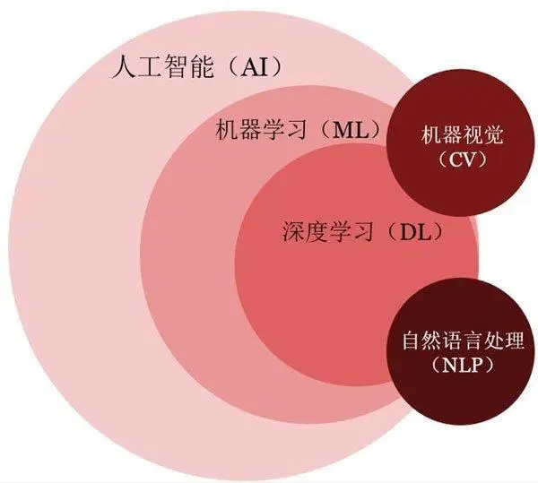
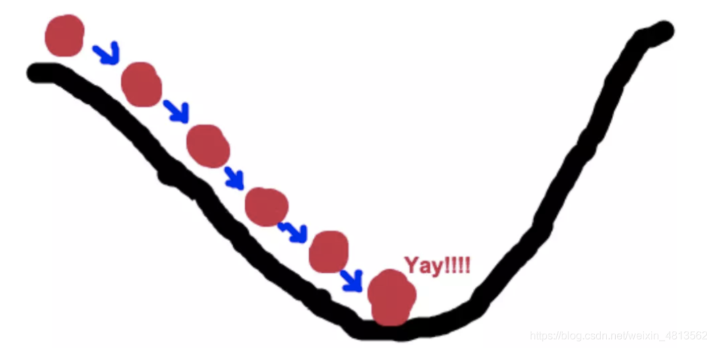

# 🟢 人工智能基础

什么是人工智能？很多人能举出很多例子说这就是人工智能，但是让我们给它定义一个概念大家又觉得很难描述的清楚。实际上，人工智能并不是计算机科学领域专属的概念，在其他学科包括神经科学、心理学、哲学等也有人工智能的概念以及相关的研究。在笔者的观点里，人工智能就是机器具备同时获得、建立、发展、和运用知识的能力。

在计算机科学中，我们可以把人工智能看成是一个目标，而我们讲的机器学习、深度学习、强化学习等各种算法是实现人工智能这个目标的方法之一。

下图是非常经典的描述人工智能与机器学习、深度学习的关系的图。

## 机器学习

机器学习方法我们可以分为以下几个大类：监督学习、无监督学习和强化学习。

监督学习中，数据集的数据具有标签，比如说，我们想让机器对水果的图片进行分类，数据集中除了需要有各种水果的图片之外，还需要每张图片带有是什么水果的标签。

在无监督学习中，数据集的数据是不带有标签的，用回上面的水果图片的例子，无监督学习中，数据集只含有各种水果的图片，而不带有标签。

强化学习中，有三要素：智能体(Agent),环境(Environment)和行为（action）。智能体根据环境会有不同的行为，根据行为定义了收益函数来确定奖励或者惩罚。比如说，下围棋如果下赢了就进行奖励，如果输了则进行惩罚。同时，我们设定一些机制让智能体自己改变行为使得收益函数最大化。换句话说，通过于环境的交互不断的更新自己的行为来使自己变得更智能。

## 半监督学习
半监督学习的数据集中，部分数据有标签，而部分数据没有标签。随着现在互联网中数据量越来越大，对所有数据标注是不太可能完成的事，因此，利用少量标注的数据和大量没有标注的数据进行训练成为了一个研究方向之一。

## 自监督学习
自监督学习是利用辅助任务从大量的无标签数据中挖掘表征特性作为监督信息，来提升模型的特征提取能力。比如在自然语言处理的预训练模型过程中，设计了挖空让模型去做完形填空，把两个句子拼接让模型判断第二个句子是否承接第一个句子等任务来进行训练。自监督学习的监督信息不是人工标注的，而是算法在大量无标注数据中自动构造监督信息来进行监督学习或者训练，这就是自监督学习。

## 深度学习

深度学习主要基于深度神经网络，属于监督学习的一种，它的训练需要带有标签的数据，但是现在的深度学习领域模型并不一定单纯的属于监督学习，比如说语言模型预训练的过程属于自监督学习。

目前神经网络的结构五花八门，并且神经网络的层数都堆得比较深，因此神经网络可以看成是一个黑盒，目前还没有严谨的数学证明证明神经网络为什么有效，不同于传统的统计机器学习，比如SVM(支持向量机)等，具有严格的数学证明证明它是有效的。所以深度学习的从业者门通常自嘲自己是在炼丹，只要输入数据（原材料），然后一段时间后看结果是否符合自己的预期（丹成）。

## 训练
模型有了，训练数据集也有了，那么AI是怎么训练的呢？AI的训练准备大致分为：数据收集与数据预处理，模型构建，定义损失函数和优化方法，训练、检验与优化。

数据量和数据的质量是至关重要的一环，业内有句话叫数据为王，谁的数据量越大、数据质量越高，那么理论上就能拥有最“智能”的AI。

AI的“学习”过程其实就是模型参数的更新，那么AI是怎么更新参数的呢？答案是通过定义损失函数和梯度下降的方法。

损失函数就是用来衡量你的模型的输出和实际你需要的输出之间的差距/不一致程度的函数，模型的输出我们叫它预测值，数据集中的标签是我们的实际值。比如说，我要训练一个模型能分清楚各种水果，因为模型没有办法知道什么是苹果、香蕉、葡萄等，所以在正式训练之前，我们会把数据的标签转换成数字的形式，比如1代表苹果，2代表香蕉，3代表葡萄......然后我们训练的时候，模型读取一张苹果图片进去，模型输出的预测值为2，但是苹果的标签实际值为1，于是就知道模型的预测和实际的正确值有误差，我们定义损失函数就是用来衡量这个误差。

损失函数有很多种，不同的任务会使用不同的损失函数。有了损失函数之后，我们就可以优化模型的参数来最小化损失函数，损失越小代表了模型的预测越准。 而优化的一种常用方法叫梯度下降，梯度下降可以类比下山的过程，如下图所示，假设这样一个场景：一个人被困在山上，需要从山上下来(i.e. 找到山的最低点，也就是山谷)。但此时山上的浓雾很大，导致可视度很低。因此，下山的路径就无法确定，他必须利用自己周围的信息去找到下山的路径。这个时候，他就可以利用梯度下降算法来帮助自己下山。具体来说就是，以他当前的所处的位置为基准，寻找这个位置最陡峭的地方，然后朝着山的高度下降的地方走，。然后每走一段距离，都反复采用同一个方法，最后就能成功的抵达山谷。

在梯度下降的过程中，模型的参数会不断的更新，直到最后到达最低点。

虽然梯度下降的原理很直白很简单，但实际中，这座山不是只有一个山峰和一个山谷的，因此到达的山谷可能只是一个局部最优点而不是全局最优点，梯度下降也有很多的改进尽可能让模型不会落在一个局部最优点就停下，但是实际上神经网络的解空间比较复杂，并不一定能找到全局最优点，以及无法证明找到的点是全局最优。尽管不能保证找到的点是全局最优，但是目前的技术下找到的最优点已经足够优秀，所以不一定话费更大的精力去寻找全局最优。

### 过拟合与欠拟合
我们收集到数据在进行数据预处理之后的数据集并不是直接丢给模型训练的，一般情况下会把数据集分割成训练集和测试集（8:2的比例）。测试集的数据是不存在于训练集中，也就是在模型训练的阶段，模型没有见过这部分的数据的。当我们在训练集上训练好模型的时候，我们会在测试集上去测试模型的效果。下图展示的是我们会遇到的三种常见情况：欠拟合、拟合的符合我们的预期、和过拟合。

欠拟合的情况下就说明模型学习的不够，模型不够聪明学会我们让它学的东西，表现为在训练集上的效果和测试集上的效果都不好。可以解决欠拟合的方法有：
1. 引入更多特征
2. 使用非线性模型
3. 使用更复杂的模型
等等

过拟合的方法则是另一个极端，模型在训练集上学习的太好以致于太死板了，不会变通，变现为在训练集上的效果很优秀，但是在测试集上的表现比较差。比如说，我们让模型去识别写的字，识别一个人字，过拟合的表现就是模型得这个人字写的很端正、字迹与训练集中看到的一致才会识别出它是一个人字，如果这个人字的字迹不同、写的不端正等等，模型则无法正确识别出这个字，很明显这种情况下模型的表现也是不符合我们的预期的。解决过拟合的方法有：
1. 扩大训练数据集，使用更多数据去训练
2. 降低模型的复杂度或者更换使用简单点的模型
3. 加入正则化
4. 在合适的时候停止训练，防止训练过度
等等

