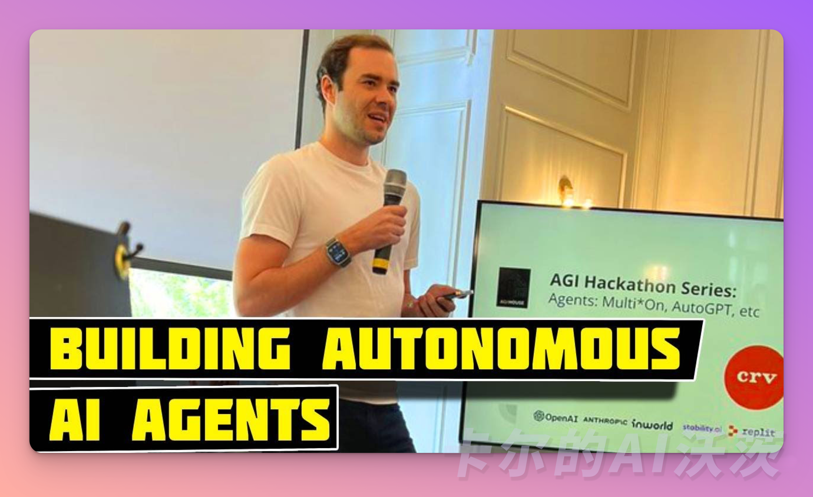
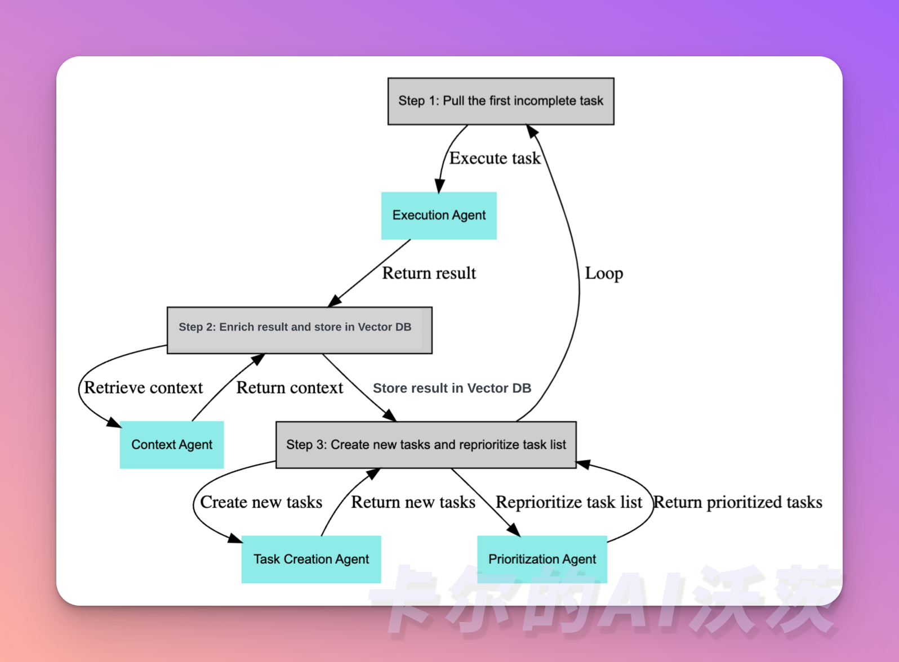

# 🟢 Agent的颠覆性影响

OpenAI联合创始人Andrej Karpathy在一个开发者活动上发表讲话，谈及了他和OpenAI对AI Agents的看法。他将过去开发 AI Agents 的困难与现在依靠新技术工具而带来的新机会进行了对比。Andrej Karpathy 认为普通人、创业者和极客在构建 AI Agents 方面相比 OpenAI 这样的公司有更多优势，因为大家都处于平等竞争的状态。他对这一领域的成果充满期待。



另外，OpenAI 应用研究主管 Lilian Weng 在一篇长文中提出了 Agent = LLM（大型语言模型）+记忆+规划技能+工具使用这一概念，并详细解释了Agent的每个模块的功能。她对Agent未来的应用前景充满信心，但也表明到挑战无处不在。

现有的 Agents 项目如 AutoGPT，BabyAGI 和 MetaGPT 的成功验证了LLM的潜力。LLM 不仅仅是一个文本生成工具，它可以成为一个强大的通用问题解决器。无论是写作、故事、论文还是程序等，LLM 都能应对自如。它展现了巨大的潜力，在解决现实世界难题方面具备强大的能力。

BabyAGI 的创造者 Yohei Nakajima 曾说：“The future of autonomous agents looks like everybody becoming a manager.” 这句话很好地概括了我们对 Agents 的展望。

🎉开始阅读前，如果你对其他文章感兴趣，欢迎关注我们「AI集训营」开源 AIGC 学习社区，以获得后续的更新🎉

## Agent是什么？跟GPT的区别

Agent 不仅可以完成具体任务，如推荐内容、撰写文案、回答问题，而且还可以帮助你实现更复杂的目标。你可以将它看作一个队友，而不仅仅是一个工具。你可以让 Agent 思考，并给它一个目标，甚至是像“创造世界上最好的冰淇淋”这样模糊的目标。Agent将会为你生成一个待办事项列表，并根据进展不断添加新的任务，直到达到目标。

在进一步深入了解之前，让我们先解释一些术语。在人工智能领域，理解这些专有术语是非常重要的，以确保我们掌握准确的概念。

> GPT = generative pre-trained transformer，也就是生成式预训练转换器，这是驱动大型语言模型（LLM）如 ChatGPT 的核心机器学习模型架构。

接下来，我们来看看什么是Agent：

> Agent（Agent）= 一个设置了一些目标或任务，可以迭代运行的大型语言模型。它与大型语言模型（LLM）在像ChatGPT这样的工具中“通常”的使用方式不同。在ChatGPT中，你提出一个问题并获得答案作为回应。而Agent拥有复杂的工作流程，可以自我对话，而无需人类驱动每一部分的交互。

自主Agent是由人工智能驱动的程序，当给定目标时，它们能够自己创建任务、完成任务、创建新任务、重新确定任务列表的优先级、完成新的顶级任务，并循环直到达到目标。

ChatGPT通过接收单一查询输入并返回输出，一次完成一个任务。但是，随着ChatGPT插件的推出，这一限制有所改变。现在，模型可以利用外部工具来一次执行多达10个请求。这是ChatGPT中“Agent”概念的一次体现，因为模型能够决定是否发送额外的请求，以完成任务。

对于那些可能还没有尝试过插件的人来说，基本的概念是你可以告诉ChatGPT某个外部工具的API是如何工作的，然后它就可以编写并执行代码，根据用户查询向该API发送请求。比如，如果你有一个天气插件，当用户问“纽约的温度是多少”，模型就会知道它无法回答这个问题，并查看用户安装的可用插件。假设它发送请求，API返回了一个错误信息，说“纽约不是一个有效的地点，请使用详细的城市名称，不要使用缩写”，模型实际上可以读取这个错误并发送新的请求来修复它。这是现今生产流程中Agent工作的最简单示例。

如果你还没有尝试过插件，基本概念是你可以告诉ChatGPT某个外部工具的API如何工作，然后模型可以编写并执行代码，向该API发送请求以回答用户查询。举个例子，如果你有一个天气插件，当用户问“北方的温度是多少”，模型就会知道自己不能回答这个问题，并检查用户安装的可用插件。假设它发送了一个请求，但API返回了一个错误信息，提示“北方不是一个有效的地点，请使用详细的城市名称”。模型实际上可以**读取这个错误信息，并发送新的请求来修正它**。这是一个生产中Agent工作的最简单示例。

一个精简的Agent决策流程：

**感知（Perception）→ 规划（Planning）→ 行动（Action）**

- 感知（Perception）是指Agent从环境中收集信息并从中提取相关知识的能力。
- 规划（Planning）是指Agent为了某一目标而作出的决策过程。
- 行动（Action）是指基于环境和规划做出的动作。

Agent通过感知从环境中收集信息并提取相关知识。然后通过规划为了达到某个目标做出决策。最后，通过行动基于环境和规划做出具体的动作。Policy是Agent做出行动的核心决策，而行动又为进一步感知提供了观察的前提和基础，形成了一个自主的闭环学习过程。

## Agent 图解

我可以通过可视化和实例来进一步解释 Agent 的概念：Agent 是让 LLM（大型语言模型）具备目标实现的能力，并通过自我激励循环来实现这个目标。

与其说交互是线性的，不如说它可以是**并行**的（同时使用多个提示，试图解决同一个目标）和**单向**的（无需人类参与对话）。

这个过程在为Agent创建一个目标或主任务后，主要分为以下三个步骤：



1. 获取第一个未完成的任务
2. 收集中间结果并储存到向量数据库中
3. 创建新的任务，并重新设置任务列表的优先级

让我们一起来看一个具体的例子。我们可以从一个任务开始，例如"编写一篇关于ChatGPT以及它能做什么的1500字博客"。

模型接收这个要求，并按照以下步骤执行操作：

```python
sub_tasks = openai.ChatCompletion.create(
  model="gpt-4",
  messages=[
    {"role": "system", "content": "You are an world class assistant designed to help people accomplish tasks"},
    {"role": "user", "content": "Create a 1500 word blog post on ChatGPT and what it can do"},
    {"role": "user", "content": "Take the users request above and break it down into simple sub-tasks which can be easily done."}
  ]
)
```

在这个例子中，我们使用OpenAI API来驱动 Agent。通过**system**字段，你可以在一定程度上定义你的Agent。然后，我们添加**user content** Create a 1500 word blog post on ChatGPT and what it can do，以及下一步骤 **Take the users request above and break it down into simple sub-tasks which can be easily done.**，也就是在此基础上添加任务，将查询分解成子任务。

然后，你可以获取子任务，并在循环中向模型发送更多的调用，执行所有这些子任务，每个子任务都有不同的系统消息（想象成不同的Agent，可能是一个擅长写作的Agent，一个擅长学术研究的Agent等）。

接下来，你可以向模型循环发送更多的调用，执行每个子任务。每个子任务都可以有不同的系统消息，你可以想象这些系统消息代表了不同领域的专家，例如一个擅长写作的专家、一个擅长学术研究的专家等等。这样，你可以让模型在不同的角色下进行思考和响应，从而更好地满足用户的需求。

> 恭喜你离 Agent又近了一步！欢迎关注「AI集训营」

## References
- [What are GPT Agents? A deep dive into the AI interface of the future](https://logankilpatrick.medium.com/what-are-gpt-agents-a-deep-dive-into-the-ai-interface-of-the-future-3c376dcb0824)
