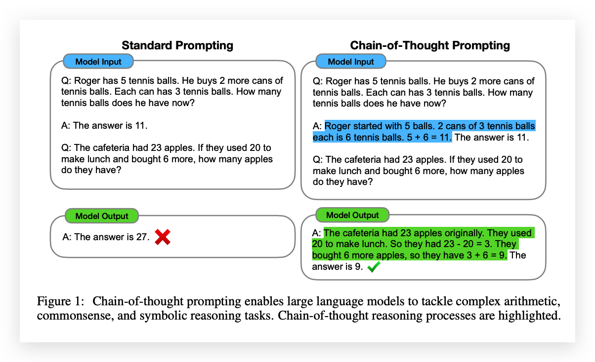

# 思维链 Chain of Thought Prompting

Jason Wei等作者对思维链的定义是**一系列的中间推理步骤（ a series of intermediate reasoning steps ）**。目的是为了提高大型语言模型（LLM）进行复杂推理的能力。

思维链通常是伴随着算术，常识和符号推理等复杂推理任务出现的。在解决复杂的推理任务（例如多步骤的数学单词问题）时，典型的做法是将问题分解成多个中间步骤，并逐一解决，然后再给出最后的答案。思维链为模型提供了一个可解释的窗口，引导它如何得出一个特定的答案并提供机会来调试推理过程中的出错点。

## 算术推理

### Standard Prompting

这是一个很明显的错误答案。

### Chain of Thought Prompting

这次我们给出了详细的解题步骤：

这一次，ChatGPT轻松算出了我们想要的答案。

