# 摄影艺术

在本篇，我将人像摄影师的工作流程分解成多个部分，并通过多个案例来说明 Midjourney 如何在每个阶段增强摄影师的能力。

## 想法和灵感

在开始一个项目之前，你可以探索 [Pinterest](https://www.pinterest.com/)、[Tumblr](https://www.tumblr.com/)、[Flickr](https://www.flickr.com/) 和许多其他资源，从而了解其他艺术家在你之前所做的事情并寻求灵感。

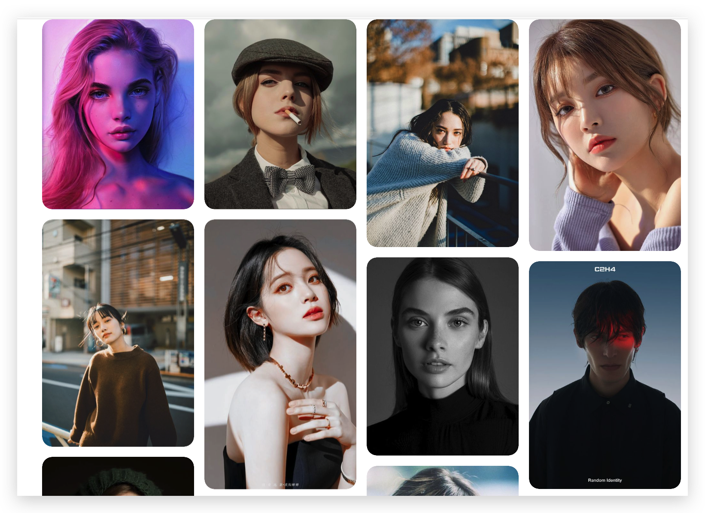

时至今日，我们可以通过询问 Midjourney 来获得创意。

|图片 |提示 | 
|--|--|
|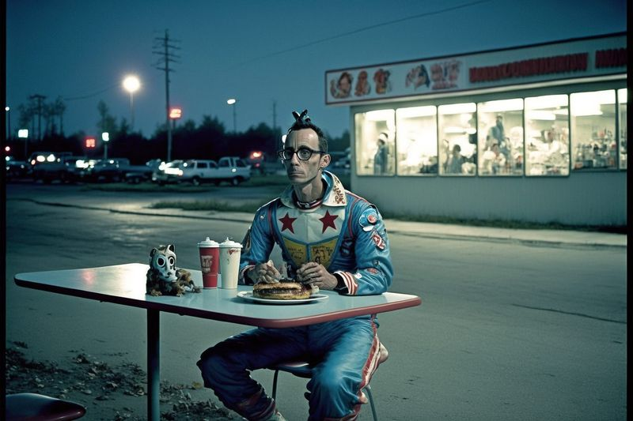 | Chuck Palahniuk in diner's mascot costume eating hamburgers on an empty parking lot behind the diner. Photograph by Gregory Crewdson --ar 3:2 |
| | portrait of a famous physicist in his lab in 1960s style. Photograph by Anton Corbijn --ar 3:2 |
|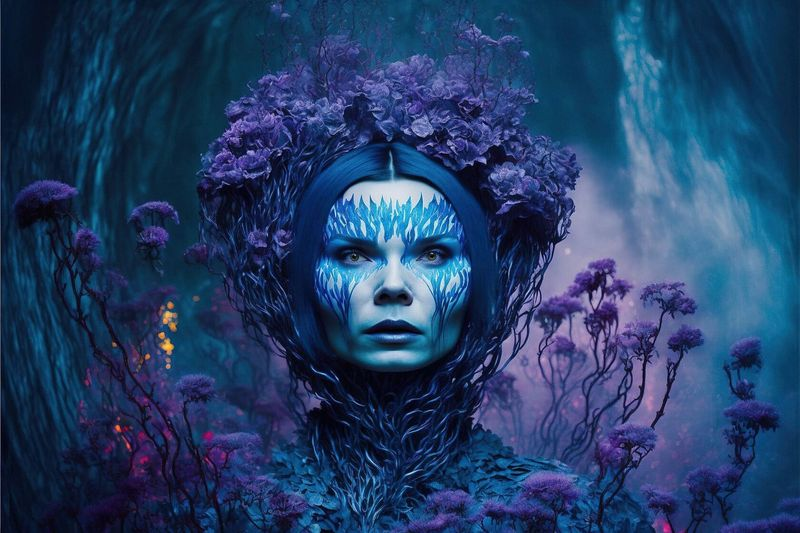 |Bjork as otherworldly floral elven alien in misty forest. Portrait by Aliza Razell --ar 3:2 --stylize 1000 |

## 混合想法

借助 Midjourney，你可以用你喜欢的艺术家的风格来拍摄一张照片，从而激发你的灵感。

|原始图片 | 新图片 | 提示 | 
|--|--|--|
| |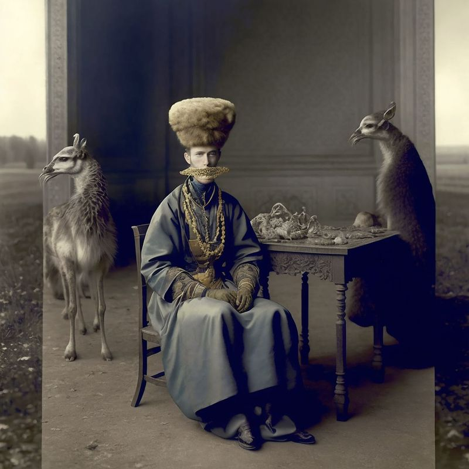  |[IMAGE PROMPT] as high concept fashion photoshoot by Karen Knoor --s 1000 |
|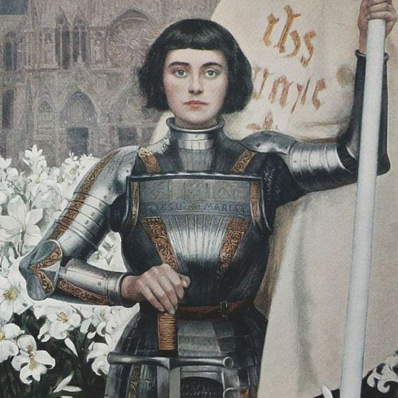 |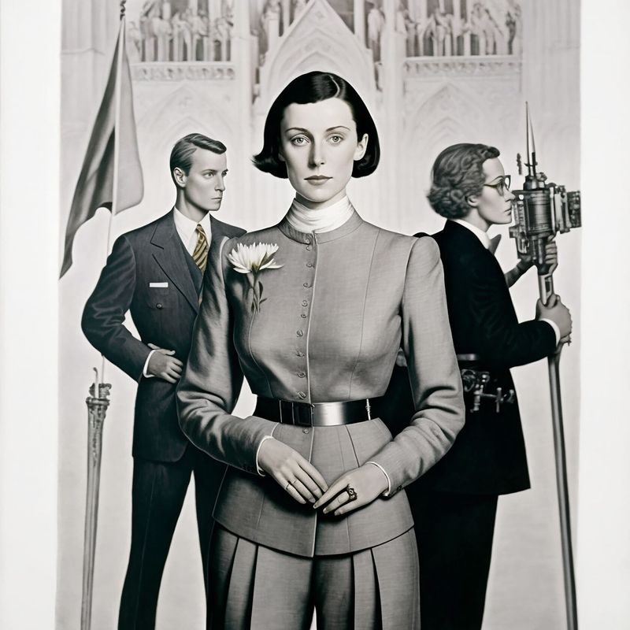  |[IMAGE PROMPT] business photoshoot by Richardson Avedon|

:::note
表格中的[IMAGE PROMPT]代表的是原始图片的图片提示。
:::

## 预期可视化

预期可视化——一个寻找参考资料、组装情绪板、绘制草图、整理或渲染未来照片拍摄最终结果的过程——这是每个项目的关键阶段，可以让我们更好地设想我们的想法。

### 情绪板和参考图像

你要做的第一件事是寻找参考图片并制作情绪板。

通常，我会在互联网上搜索以找到确切图像来说明想法。我会尝试尽可能详细和精确地展示我如何看待背景、造型、姿势、灯光和化妆。

只需一个提示，你就可以在 Midjourney 上预想拍摄风格、地点、化妆概念、场景氛围等等。

| 图片 | 提示 | 
|--|--|
|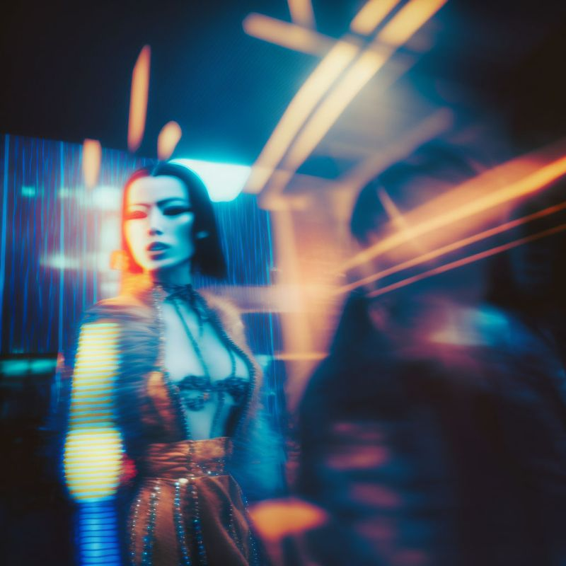  |portrait of fashion model in futuristic Japanese club. Intentional camera movement, wild mood |
|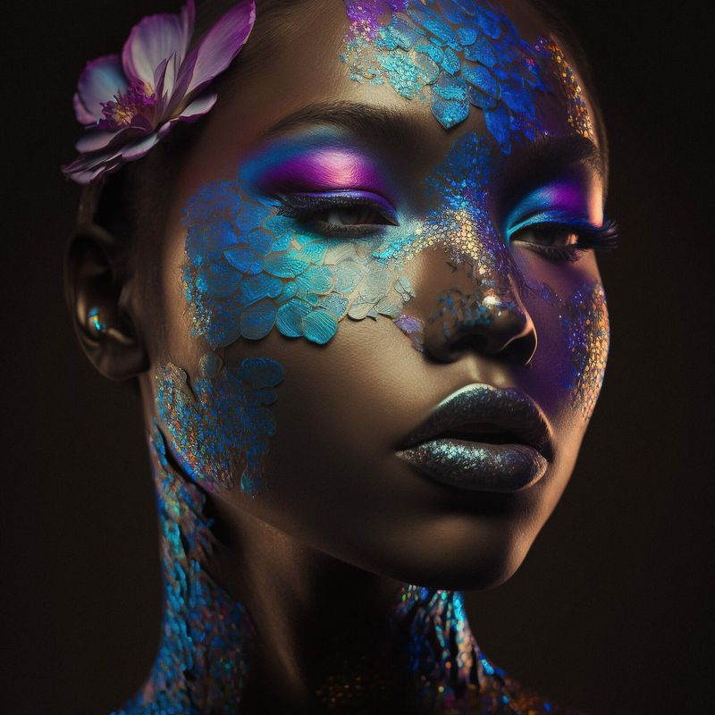  |creative iridescent makeup with space floral patterns. Close-up portrait of a young female model. Contrasty lighting --s 910 |

你还可以通过直接询问 Midjourney 来概述情绪板页面。

情绪板（英语：mood board），是由图像、文本等数个样本组成视觉呈现或拼贴图。情绪板，用于传达对特定主题的想法或感受的演示工具。

平面设计师、室内设计师、工业设计师、摄影师、用户界面设计师和其他创意工作者多使用情绪板来直观地说明作品计划呈现的风格。情绪板。在创作过程中，情绪板可以平衡协作与创作上的自由。

| 图片 | 提示 | 
|--|--|
|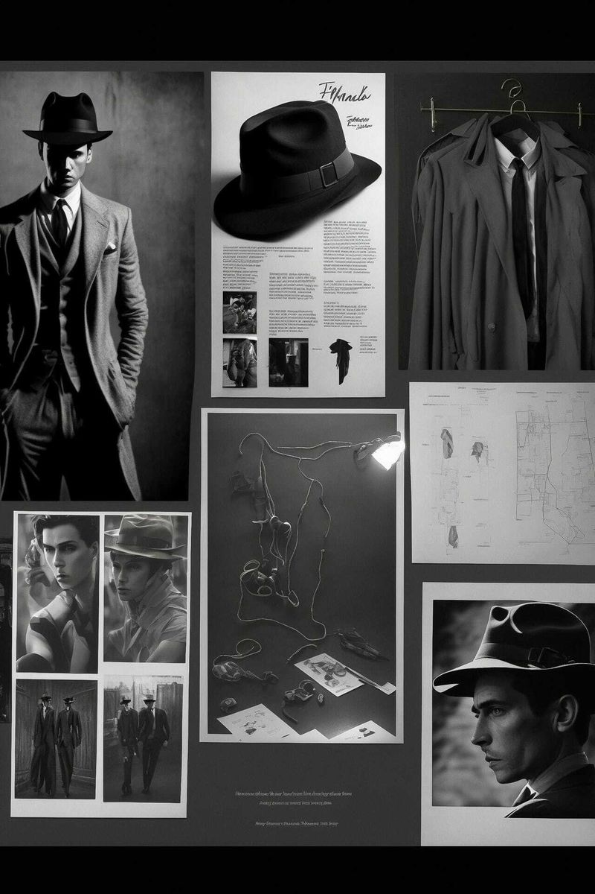  |mood board props references page for noir themed photo shoot --ar 2:3 --stylize 350 |
|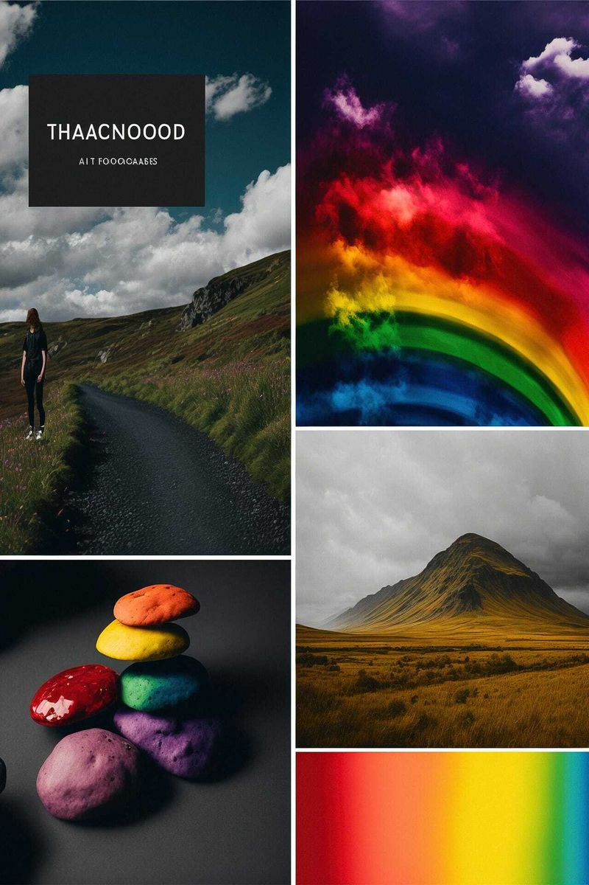  |mood board location references page for rainbow themed photo shoot --ar 2:3 --stylize 50 |

## 布景设计

在复杂的肖像摄影类型中工作，你会希望为你的模特创造一个独特而令人难忘的世界，让你的模特栖息在你的画面中。

| 图片 | 提示 | 
|---|---|
|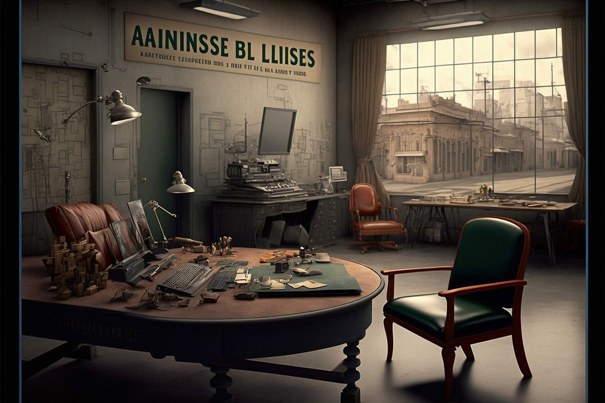  |business themed set design by Annie Leibovitz --ar 3:2 |
|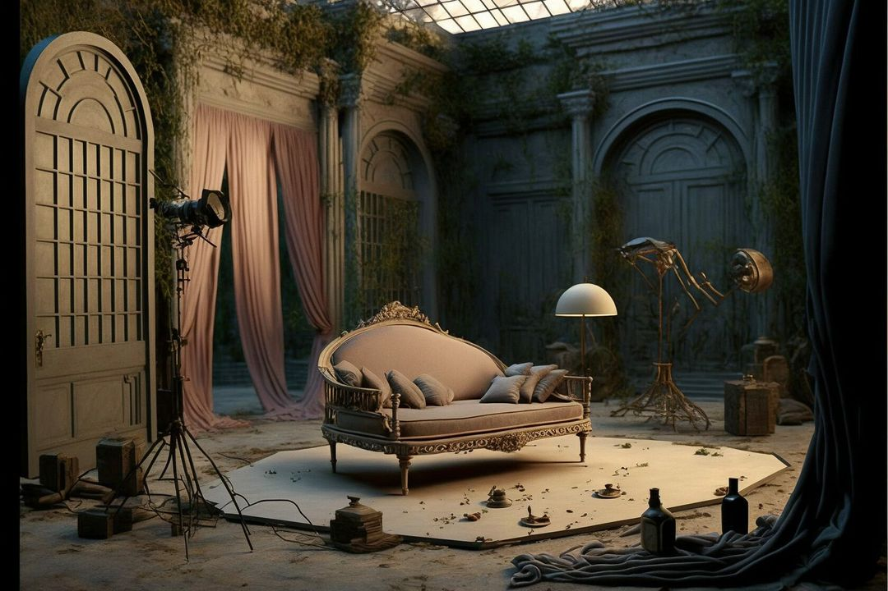  |business themed set design by Annie Leibovitz --ar 3:2 |
|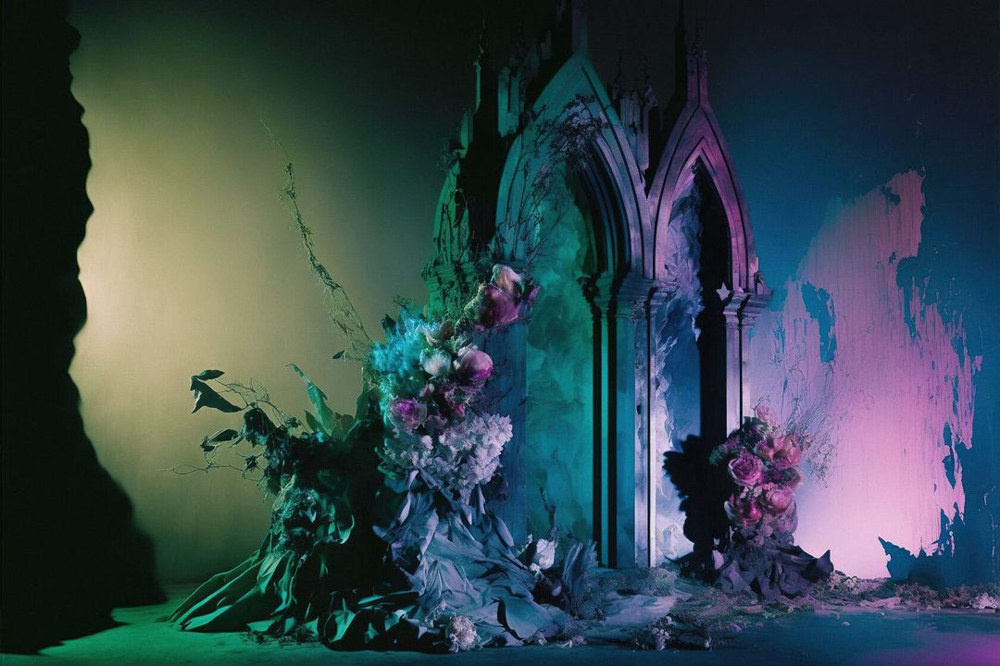  |Tim Walker's set design for mystical photo shoot --ar 3:2 --stylize 75 |

我在所有提示中添加了 **--no people person man woman boy girl model ** 我们只需要背景本身，如果不是那个小技巧，Midjourney 将始终生成人类。

## 造型和道具

通常，你必须寻找所需的道具或服装。打电话给电影或戏剧制作，去服装租赁，或者让造型师参与并将其委托给专业人士。在这种情况下， Midjourney 能生成非常出色的道具参考图片！

| 图片 | 提示 | 
|---|---|
|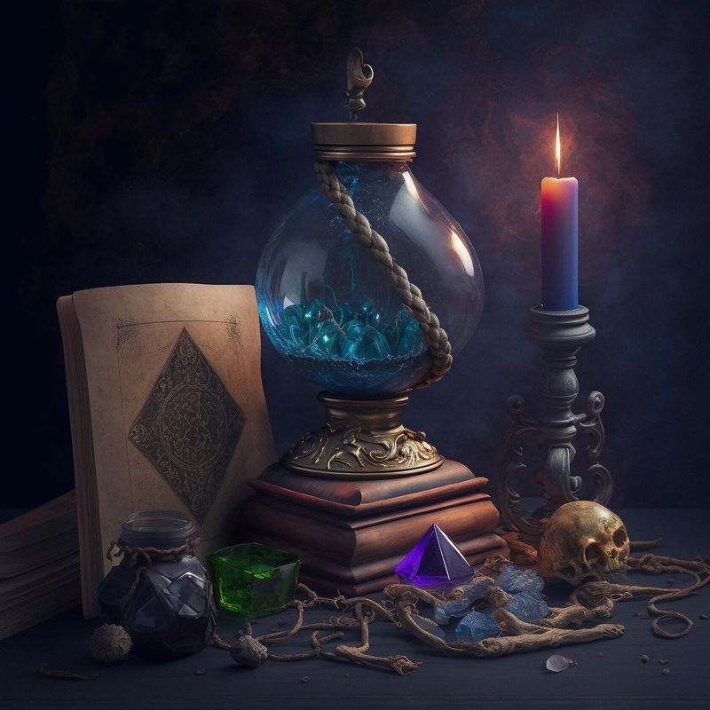  |props for a magic themed photo shoot |
|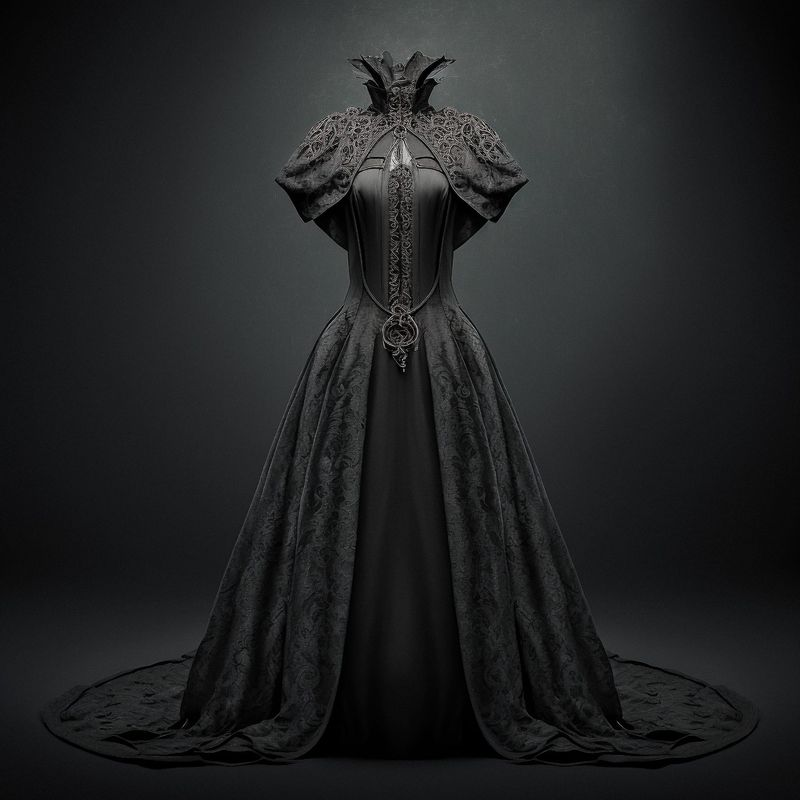  |gothic dress on clean backdrop. Prop for fashion photo shoot --stylize 300 |
|  |costume and props for photo shoot in style of Magic The Gathering |

## 摄影技巧

### 人像摄影的种类

我们可以从肖像摄影师最基本的东西开始，并尝试向 Midjourney 询问一些不同类型的肖像。

### 灯光

在 Midjourney 中，你可以设置光照的方向、质量和颜色。对于此测试，我对提示的文本部分使用了标准公式：**Portrait shot with ...**

‍为了简单起见，我只会在示例下方提及光线类型。

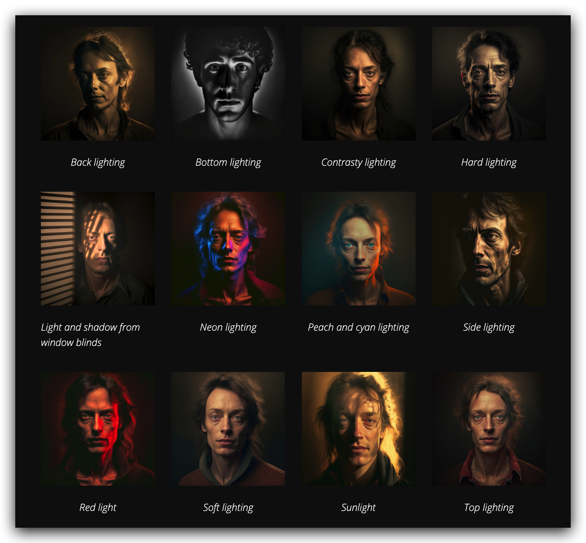

### 快门设置

快门速度的设置同样能影响最终的图片效果

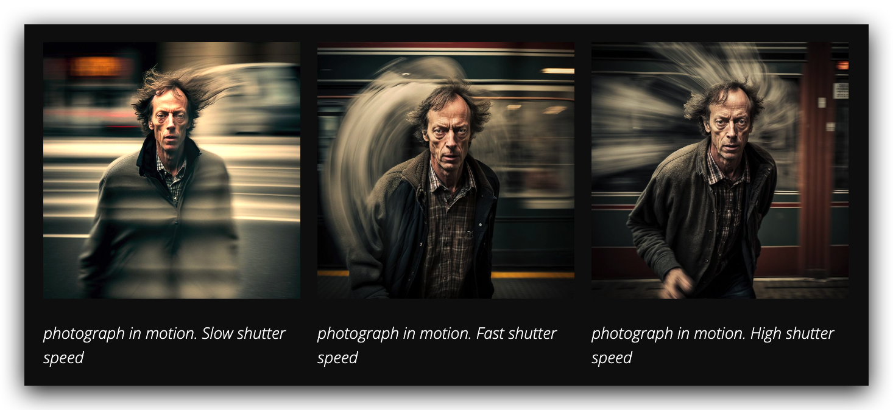

### 构图

在 Midjourney 中，我们可以部分控制图片的构图。虽然目前 Midjourney 很难指定某些类型的构图（不对称、偏心、黄金比例等——似乎都不起作用），但你仍然可以成功地设置拍摄角度。

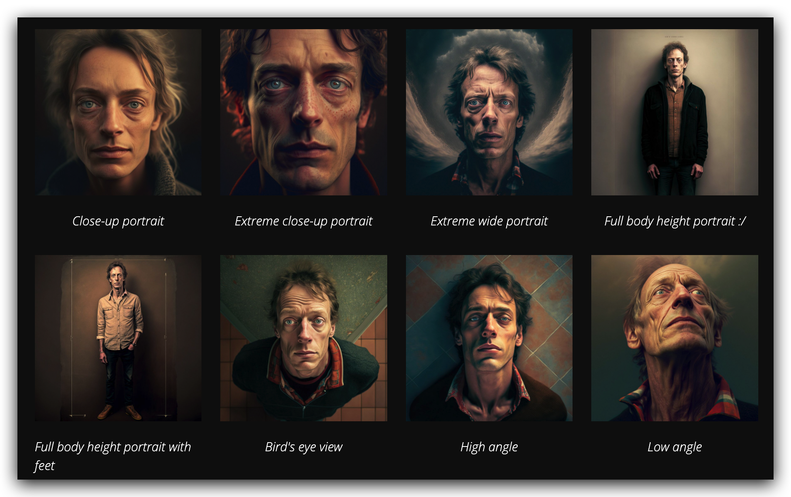

### 镜头

除了构图，你还可以使用不同的镜头来构成图片：

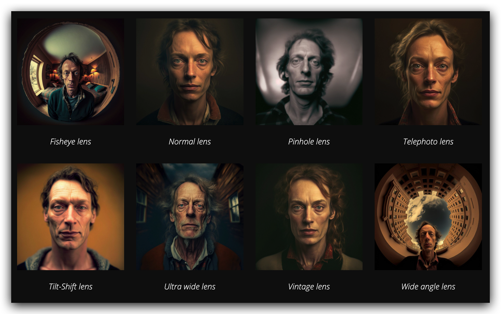

By Andrei Kovalev 和 Midlibrary 团队

